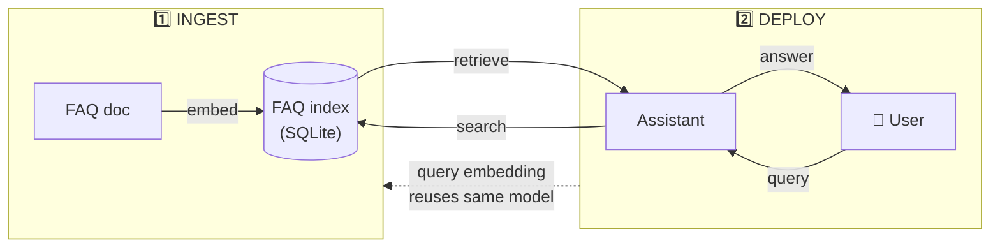

# Vector Search with sqlitesearch

Video: [Watch this lesson](https://www.youtube.com/watch?v=csxKescwJYM&list=PL3MmuxUbc_hLZFNgSad56pDBKK8KO0XIv)

In the previous section we used minsearch for vector search.

It works, but it has three problems:

- It rebuilds the index on every startup
- It keeps everything in memory
- It searches by brute force


With text search we never felt these. Indexing was fast because we
didn't embed anything. With vector search, indexing runs a neural
network over every document, so it takes a minute on our dataset.
Keeping everything in memory is fine here, but a larger dataset would
need too much space.

The third problem is brute-force search. For every query we compare the
query vector against every single document. With 1,000 documents this is
fine, probably even faster than anything smarter. But as the dataset
grows past 10,000 or so, it gets slow, and we'll want an approximate
method instead.

What we've done so far is exact nearest neighbor (NN) search. We score
the query against every document and pick the top ones. It always finds
the true top matches, but it pays for that by touching everything.

Approximate nearest neighbor (ANN) search takes a shortcut. Instead of
comparing against everything, it first narrows down to a region of
likely matches. Then it scores only within that region. It may miss the
absolute best match, but the results are still good and it's much
faster.

```text
NN (exact) | *Nearest Neighbors*:    compare query against ALL documents -> top 5
ANN (approx) | *Approximate Nearest Neighbors*:  narrow down to a region -> compare within region -> top 5
```

## SqliteSearch

Sqlitesearch is the persistent sibling of minsearch, and it solves both
problems at once.

We already used it in module 1 for persistent text search. It also does
vector search through its `VectorSearchIndex` class. It stores vectors
in SQLite, a real on-disk database, and uses ANN strategies for
retrieval. Because the data lives on disk, one process can write the
vectors and another can read them back.

If you didn't install it in the previous module, add it to your project:

```bash
uv add sqlitesearch
```

## Creating the index

Initialize it:

```python
from sqlitesearch import VectorSearchIndex

vs_index = VectorSearchIndex(
    keyword_fields=["course"],
    mode="ivf",
    db_path="faq_vectors2.db"
)
```

sqlitesearch supports three ANN modes:

- `lsh` (default): up to 100K vectors, random hyperplane projections
- `ivf`: 10K-500K vectors, K-means clustering
- `hnsw`: 10K-1M+ vectors, proximity graph (highest recall)

For our small dataset, `lsh` is fine. All modes use two-phase search:
approximate candidate retrieval, then exact cosine similarity
reranking.

## Reopening the index

In a new Python session, you can reopen the index without re-computing
embeddings:

```python
from sentence_transformers import SentenceTransformer
from sqlitesearch import VectorSearchIndex

model = SentenceTransformer("all-MiniLM-L6-v2")

vs_index = VectorSearchIndex(
    keyword_fields=["course"],
    mode="ivf",
    db_path="faq_vectors2.db"
)
```

Now we can search:

```python
query_vector = model.encode("How do I run Kafka?")
results = vs_index.search(query_vector, num_results=5)
```

We still load the embedding model to encode the query, but we don't
re-embed all the documents. No `fit` call needed, because the index is
already built and waiting on disk.

This is the same two-process split we used for text search in module 1.
One process ingests and builds the index, another queries it.

It matters more here than with text search. Embedding the whole dataset
takes about a minute. We don't want a user waiting that long when the
app starts up. We pay that cost once during ingestion, and the query
side starts up instantly.

## Comparing minsearch and sqlitesearch for vector search

Here is how the two compare:

- minsearch `VectorSearch`: in-memory (numpy), exact cosine similarity,
  must re-compute embeddings on startup, good for experiments and
  notebooks
- sqlitesearch `VectorSearchIndex`: persistent (SQLite `.db` file), ANN
  (LSH/IVF/HNSW) with exact rerank, can open an existing index, good
  for projects and persistence

This is probably the last you'll hear of sqlitesearch. I built it for
teaching, to show the ingestion-then-deployment split.

It does have a real use though. Its only dependencies are SQLite and
numpy. So it runs on any host that offers a free SQLite database, where
a dedicated vector database would cost extra. For most work you'll reach
for something else, which is what we do next.

